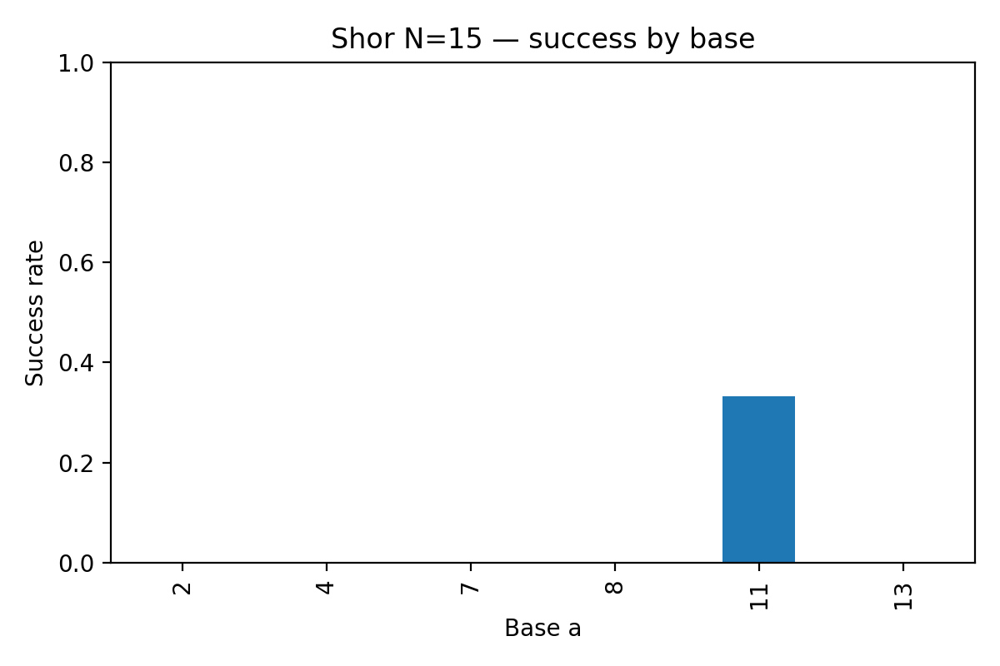

# Quantum-PQC Dual Threat Lab

This repository explores the **dual threats of quantum computing and side-channel leakage** against modern cryptography.  
It combines **quantum algorithm simulations** with **post-quantum cryptography (PQC) side-channel testing**.

---

## ⚠️ Disclaimer

This project is for **educational and research purposes only**.  
All experiments were performed in controlled environments using simulated or test inputs.  
Do **not** use these methods to attack real systems.  
If new vulnerabilities are found, follow responsible disclosure guidelines.

---

## 🔹 Part I: Quantum Cryptanalysis

This part investigates how future quantum computers could threaten RSA, ECC, and symmetric cryptography by using algorithms like **Shor’s** and **Grover’s**. We also explore qubit scaling projections (Rose’s Law) and resource estimation using Q#.

---

### 1. Grover’s Algorithm vs Classical Search

We tested the asymptotic complexity of Grover’s algorithm compared to brute-force key search.

- **Asymptotic operations:**  
  

- **Illustrative runtime scaling:**  
  

**Explanation:**  
Classical brute force requires \(O(2^n)\) operations, while Grover reduces this to \(O(2^{n/2})\).  
The plots show that Grover’s advantage grows as key sizes increase (e.g., AES-256 has the security of AES-128 against Grover).  
However, the results also highlight that the **quadratic speedup is not a silver bullet** — it reduces key sizes needed, but doesn’t make brute force suddenly practical.

---

### 2. Shor’s Algorithm vs Classical Factoring

We implemented Shor’s algorithm to factor \(N=15\) and compared it against classical factoring.

- **Classical vs quantum sim runtimes:**  
  

- **Quantum elapsed time by base:**  
  

- **Success rate by base:**  
  

- **Asymptotic factoring cost (GNFS vs Shor):**  
  

**Explanation:**  
- For small composites like 15, **classical factoring is trivial**, while Shor’s algorithm suffers from simulator overhead.  
- Success varies depending on the chosen base; only some bases yield correct factors.  
- Asymptotically, Shor’s cubic cost \(O(k^3)\) is vastly better than GNFS’s sub-exponential complexity, which is why RSA will eventually be broken at scale.  
- The experiment demonstrates feasibility, not efficiency — practical attacks need **millions of error-corrected qubits** [3].

Raw data: [`reports/shor_lab_results.csv`](reports/shor_lab_results.csv)

---

### 3. Q# Resource Estimation

We used Microsoft Q#’s Resource Estimator to evaluate **T-counts, physical qubits, and runtimes** under different error models.

- **Grouped summary (T-count, qubits, runtime):**  
  

- **Detailed breakdown:**  
  

**Explanation:**  
The results show:
- **T-counts** between ~90k and ~500k for modular exponentiation components.  
- **Physical qubits** range from thousands (optimistic) to hundreds of millions (conservative).  
- **Runtime estimates** span microseconds to seconds, depending on error budget.  

This demonstrates how **hardware assumptions dominate feasibility**: the math says Shor can break RSA, but the **engineering challenge of qubit counts and fidelity** keeps it out of reach — for now.

---

### 4. Rose’s Law Projection

We projected qubit growth under different doubling assumptions and compared them against cryptographic breakpoints.

**Explanation:**  
- Breakpoints for cryptography:  
  - ~1M qubits for RSA-2048.  
  - ~10M qubits for ECC-256.  
- With optimistic growth (1000 starting qubits, doubling every 12 months), these thresholds could be hit in the **late 2030s**.  
- With slower growth (doubling every 24 months), the breakpoints shift to **post-2050**.  

This aligns with academic estimates that large-scale quantum attacks on RSA/ECC are a **mid-century concern** [3].

Raw data: [`reports/quantum_timeline_scenarios.csv`](reports/quantum_timeline_scenarios.csv)

---

## 🔹 Part II: PQC Side-Channel Analysis

While quantum attacks are a long-term threat, PQC is being deployed now. A critical question: **are implementations secure against side-channels like timing leakage?**

---

### 1. Experimental Setup
- Target: **Kyber KEM (Kyber-1024)**, implemented via liboqs.  
- Input classes:  
  - **clean** (valid ciphertexts).  
  - **flipped** (single-bit faulted ciphertexts).  
- Collected **20,000 decapsulation timings** per class using nanosecond-resolution timers.  

---

### 2. Timing Results

- **Boxplot (zoomed):**  
  

- **Histogram:**  
  

- **Histogram (zoomed):**  
  

- **Violin distribution:**  
  

---

### 3. Statistical Analysis

We compared clean vs flipped distributions.

- Clean mean = **12,756 ns**; flipped mean = **12,787 ns**.  
- Welch t-test: **p = 0.24** → no significant mean difference.  
- Mann–Whitney U: **p ≈ 3e-65** → distributions differ slightly in shape, but effect size negligible.  
- Cohen’s d = **–0.012** → tiny/negligible.  
- Cliff’s delta = **0.057** → tiny.  
- AUC ≈ **0.45** → classifier worse than random guessing.  

Summary table: [`reports/kyber_timing_summary.tsv`](reports/kyber_timing_summary.tsv)  
Raw data: [`reports/kyber_clean.csv`](reports/kyber_clean.csv), [`reports/kyber_flip4.csv`](reports/kyber_flip4.csv)

---

### 4. Interpretation

- Earlier Kyber versions were vulnerable to **timing leakage during decapsulation** [1].  
- Patches introduced **constant-time rejection sampling** and **dummy secret substitution** [2].  
- Our lab confirms the **patched Kyber is constant-time**:  
  - No exploitable mean timing difference.  
  - Distributions overlap almost completely.  
  - Effect sizes are negligible.  

This demonstrates that PQC is not only resistant to quantum attacks in theory, but also hardened against **real-world side-channel threats**.

---

## 🔹 Key Takeaways

- **Quantum threat:**  
  - Shor and Grover pose fundamental risks to RSA/ECC.  
  - Rose’s Law shows feasible timelines between 2035–2055 depending on hardware growth.  

- **PQC resilience:**  
  - Our timing experiments confirm Kyber resists known side-channel attacks.  
  - PQC adoption must consider **both algorithmic security and implementation security**.  

**Conclusion:**  
The “dual threat” is clear: quantum computing threatens current crypto, while poor implementations could weaken PQC. Both must be addressed to secure the future.

---

## 🔹 References

[1] R. Avanzi et al., *“CRYSTALS-Kyber: Algorithm Specifications and Supporting Documentation”*, NIST PQC Submission, Round 3, 2021.  

[2] D. J. Bernstein, T. Chou, A. Hülsing, T. Lange, R. Niederhagen, P. Schwabe, et al., *“Post-quantum cryptography: NTRUEncrypt and Kyber”*, IEEE EuroS&P Workshops, 2017.  

[3] C. Gidney and M. Ekera, *“How to factor 2048-bit RSA integers in 8 hours using 20 million noisy qubits”*, Quantum, vol. 5, 2021.  

[4] P. Campbell, M. Groves, D. Shepherd, *“Soliloquy: A Cautionary Tale”*, ETSI/IQC Workshop on Quantum-Safe Cryptography, 2014.  

---